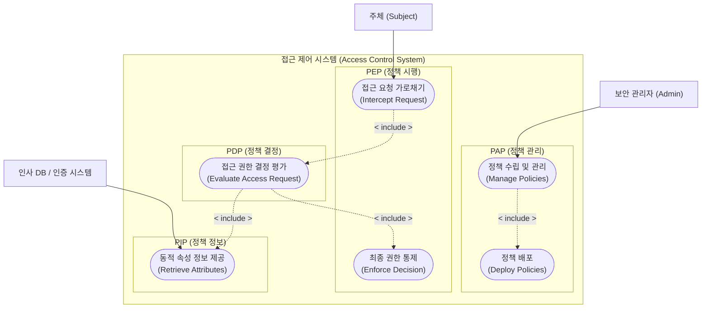
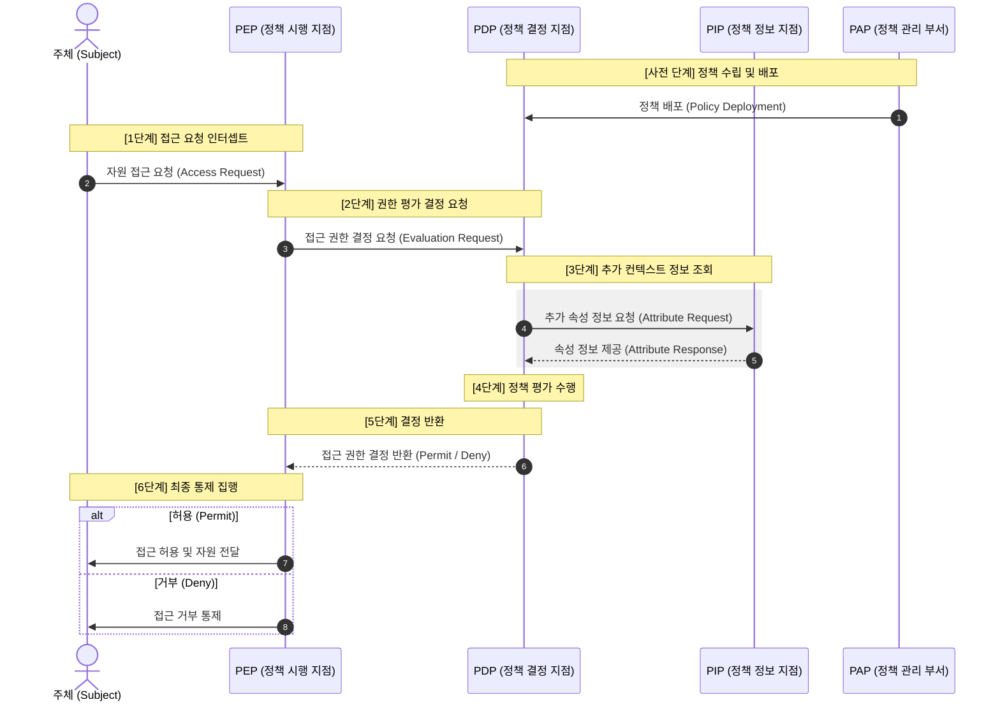
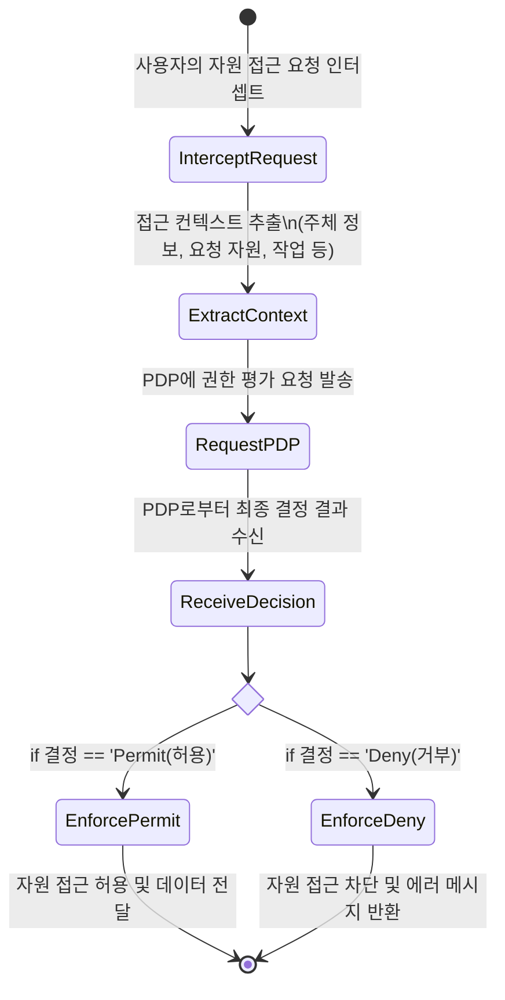
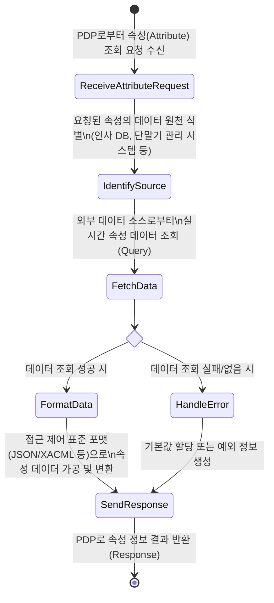
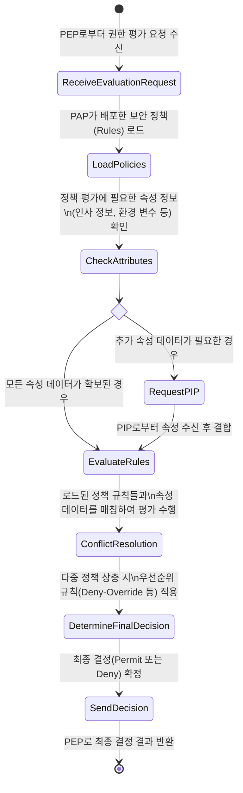
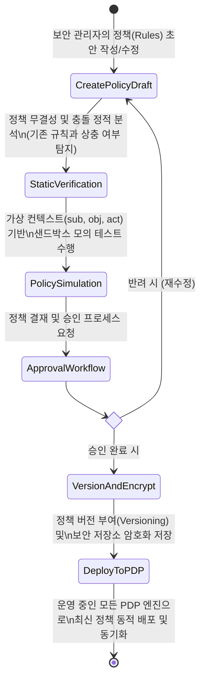

## Access Control Model 요구사항

요약 목록
- 인사담당자 관점 요구사항: 임직원 인사 정보(조직, 직급, 부서 이동 등)가 권한 부여의 기준(PIP) 데이터로 정확하고 실시간으로 연동되어야 함.
- 보안관리자 관점 요구사항: 전사 보안 규정 및 접근 통제 규칙(PAP)을 수립·배포하고, 모든 접근 요청을 예외 없이 차단·허용(PEP)하며, 정책 충돌 없이 일관되게 판정(PDP)해야 함.

### [인사담당자 관점] 권한 기준 및 정보 연동 요구사항 (주로 PIP, PAP 관련)

인사담당자는 임직원의 입사, 부서 이동, 전보, 퇴사 등 인사 이벤트에 따라 동기화되는 정확한 인사 데이터 공급과 기준 관리를 중시합니다.

- 실시간 인사 정보 동기화 (PIP 데이터 원천 연동): 전사 인사 시스템(HR DB)의 조직 정보, 마스터 직급, 부서 배치 정보가 접근 제어 시스템에 실시간으로 반영되어 권한 판정의 기초 자료로 활용될 수 있어야 합니다.
- 인사 속성 기반 권한 기준 정의 (PAP 정책 저작): 직무(Role) 기준뿐만 아니라 '소속 부서', '재직 상태', '근무지' 등 인사 카드상의 다양한 인적 속성(Attribute)을 결합하여 접근 통제 규칙을 유연하게 수립할 수 있어야 합니다.
- 데이터 무결성 보장 (PIP 최신성): 휴직자나 퇴사자의 정보가 지연 없이 즉각 반영되어, 권한 오남용 및 보안 사고를 방지할 수 있는 신뢰성 높은 데이터 중개 체계가 마련되어야 합니다.

### [보안관리자 관점] 통제 집행 및 정책 운영 요구사항 (주로 PEP, PDP, PAP 관련)

보안관리자는 보안 규정의 틈새 없는 집행, 일관된 정책 평가, 안전한 규칙 관리 및 시스템 성능 유지를 중시합니다.

- 예외 없는 전수 검사 및 게이트웨이 통제 (PEP 인터셉트/집행): 전사 자원에 대한 모든 사용자 접근 및 API 요청을 중앙에서 빠짐없이 가로채고, 판정 결과에 따라 철저하게 통제(허용/차단)해야 합니다.
- 성능 지연 및 업무 병목 최소화 (PEP 오버헤드): 모든 접근 요청의 길목에서 보안 검사가 수행되므로, 실무자의 업무 흐름을 방해하지 않도록 판정 및 통제 과정에서 발생하는 시스템 지연 시간을 최소화해야 합니다.
- 보안 정책 충돌 해결 규칙 (PDP 충돌 해결): 부서 이동이나 겸직 등으로 인해 '접근 허용'과 '접근 차단' 규칙이 동시에 적용되는 경우, '거부 정책 우선(Deny-Override)' 등 명확한 우선순위 기준에 따라 단일 결정을 내려야 합니다.
- 컨텍스트 기반 동적 판정 (PDP-PIP 연동): 고정된 권한 외에도 접속 시간, IP 대역, 기기 무결성 상태 등 실시간 보안 컨텍스트를 종합 평가하여 동적으로 접근 권한을 결정할 수 있어야 합니다.
- 정책 안전성 검증 및 시뮬레이션 (PAP 검증): 새로 수립하거나 수정한 전사 보안 규칙을 실 운영 환경에 배포하기 전, 기존 규칙과의 충돌 여부를 검증하고 영향도를 파악할 수 있는 모의 테스트 환경이 제공되어야 합니다.
- 감사 및 버전 관리 (PAP 배포): 적용된 모든 보안 정책의 생성·수정·배포 이력을 버전별로 관리하고, 무결성이 검증된 저장소에 안전하게 보관하여 향후 보안 감사(Audit)에 대응할 수 있어야 합니다.

---
## 유스케이스 다이어그램

---

## 접근 제어 모델의 구성요소 해설

- PEP (Policy Enforcement Point)
    - 사용자의 자원 접근 요청을 가로챈다.
    - PDP에 접근 결정을 요청한다.
    - PDP로부터 전달받은 결정 결과를 실제로 자원에 적용하여 접근을 통제한다.

- PDP (Policy Decision Point)
    - PEP로부터 받은 접근 요청 정보를 PAP의 정책과 PIP의 속성 정보를 바탕으로 평가한다.
    - 접근 허용(Permit), 거부(Deny), 결정 불가(Indeterminate), 적용 불가(Not Applicable) 중 하나를 판정한다.
    - 보안 정책 엔진의 핵심 역할을 수행한다.

-  PAP(Policy Administration Point)
    - 접근 제어 정책을 생성, 편집, 관리한다.
    - 정책의 저장소 역할을 수행한다.
    - 시스템 관리자가 보안 정책을 정의하는 인터페이스를 제공한다.

- PIP (Policy Information Point)
    - 정책 결정에 필요한 추가적인 속성 정보를 제공한다.
    - 사용자 정보, 리소스 정보, 환경 정보 등을 데이터베이스나 LDAP 등에서 조회한다.
    - PDP가 정책을 평가할 때 필요한 컨텍스트 데이터를 전달한다.

---
## 구성 요소간 전체 흐름

---

## PEP Activity 

PEP 기본 흐름: 요청 수신 -> 데이터 추출 -> 결정 요청 -> 결과 대기 -> 통제 집행 순으로 진행되는 PEP 내부의 활동(Activity) 흐름을 다이어그램으로 도출했습니다.

---

## PIP Activity

PIP 기본 흐름: PDP의 데이터 요청 수신 -> 데이터 원천(HR DB 등) 조회 -> 데이터 가공/포맷팅 -> PDP로 속성 전달 순으로 진행되는 PIP 내부의 활동 흐름을 도출했습니다.

---

## PDP Activity

DP 기본 흐름: PEP 요청 수신 -> 정책 저장소 조회 -> 필요시 PIP 데이터 연동 -> 정책 평가 및 충돌 해결 -> 최종 결정 반환 순으로 진행되는 PDP 내부의 활동 흐름을 도출했습니다.

---

## PAP Activity

PAP 기본 흐름: 정책 초안 작성 -> 무결성 검증 및 시뮬레이션 -> 결재 승인 -> 버전 관리 및 암호화 저장 -> PDP 배포 순으로 진행되는 PAP 내부의 핵심 관리 활동 흐름을 도출했습니다.

---

